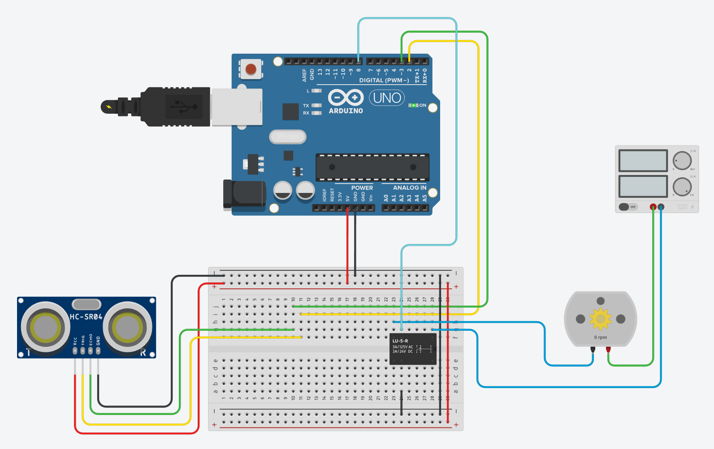

# Water-Level-Detection
This project is about detecting water level in a tank using Ultrasonic Sensor and Arduino Uno. Once the tank is filled, the water pump will be turned off using a relay module. The water pump will be turned on again when the water level is low.

